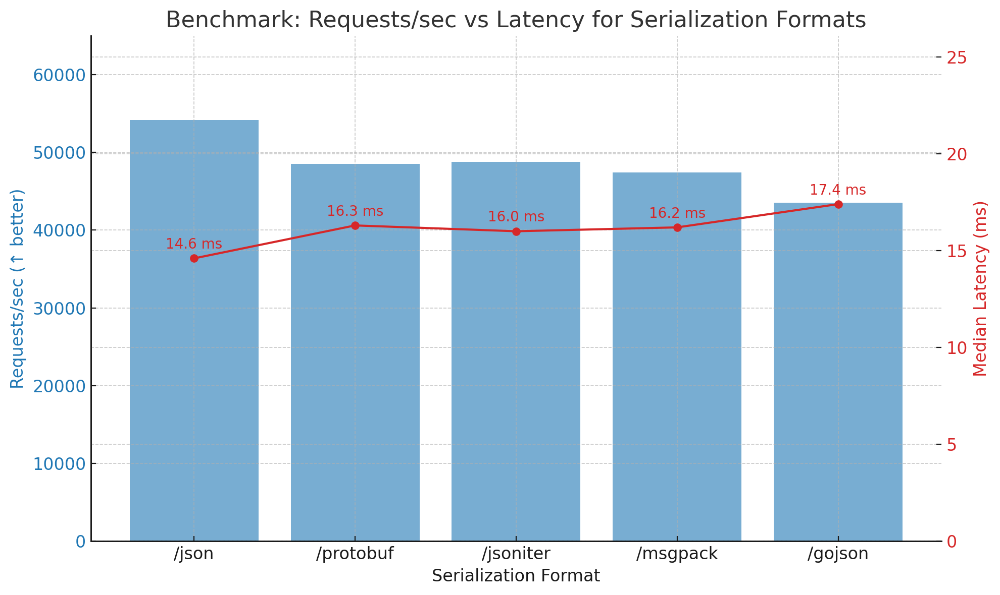

# go-serialization-bench
This repository demonstrates and benchmarks multiple serialization and deserialization strategies in Go, exposed via HTTP endpoints. It includes standard and third-party libraries for JSON, MessagePack, and Protocol Buffers.

## 🧩 Features

- Serializes and deserializes a complex Go struct using:
  - `encoding/json` (standard library)
  - `jsoniter`
  - `go-json`
  - `easyjson`
  - `msgpack`
  - `protobuf` (v2 API)
- 12 HTTP endpoints:
  - 6 for `marshal` (`GET`)
  - 6 for `unmarshal` (`POST`)
- Includes a shell script to benchmark each endpoint using [`hey`](https://github.com/rakyll/hey)

## 📦 Structure

✅ Throughput (Requests/sec)
Endpoint	RPS (↑ better)	Total Time
/json	54,181	18.45 s
/protobuf	48,525	20.60 s
/jsoniter	48,800	20.49 s
/msgpack	47,443	21.08 s
/gojson	43,558	22.96 s

encoding/json is surprisingly the fastest in this run.

gojson lagged behind, possibly due to GC pressure or inefficient unmarshaling.

📦 Payload Size
Format	Size/request
JSON	198 bytes
JSONIter	198 bytes
GoJSON	198 bytes
MsgPack	155 bytes
Protobuf	99 bytes

Protobuf and MsgPack greatly reduce payload size, which could be critical in bandwidth-constrained scenarios.

🕒 Latency (50th percentile)
Endpoint	Median Latency
/json	14.6 ms
/protobuf	16.3 ms
/msgpack	16.2 ms
/jsoniter	16.0 ms
/gojson	17.4 ms

All alternatives hover closely around 16–17ms median. encoding/json led slightly here too.

🔍 Observations
Performance tradeoff: Even though Protobuf and MsgPack are more compact, they didn’t outperform encoding/json in throughput. Likely due to encoding/decoding cost, not I/O.

Stability: All implementations handled 1M requests cleanly (100% HTTP 200), so all are stable under high concurrency.

Best case: If your bottleneck is CPU or encoding time, stick to encoding/json. If you're network-bound, switch to Protobuf for its compactness.

